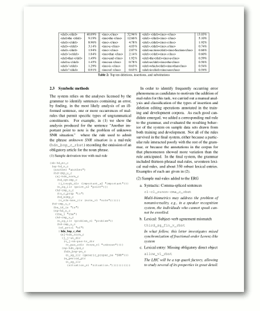
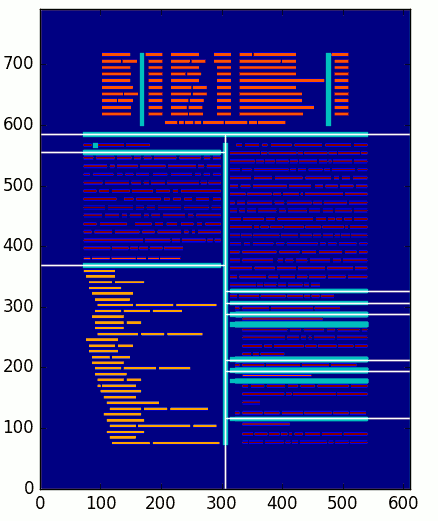

# Freki

Freki is a package that takes the markup-language formatted output of 
a PDF-to-text extraction tool (either [PDFLib TET][] or [PDFMiner][]),
and detects text *blocks* (e.g., paragraphs, headers, figures, etc.).
The blocks are assigned attributes (identifiers, bounding boxes, etc.)
for later analysis. This was developed for the detection of interlinear
glossed text (IGT), but it could serve other purposes, as well.

## Example

Shown below are an example page from a PDF (left), and a visualization
of the zones that Freki's `xycut` analyzer detected (right). In the
visualization, colored blocks are text tokens, and the colors
correspond to different text in different font sizes. The thick
light-blue lines represent potential divisions ("cuts") between zones,
while thin white lines represent the cuts that were made in the end.
Each detected zone will be further analyzed for lines of text, and the
result of this second-stage analysis is a Freki block.

| PDF                           | Anaylzed zones                       |
| ----------------------------- | ------------------------------------ |
|  |  |

The output of Freki is text with block- and line-level metadata. The
first few lines of such a block, with metadata, is given below:

```
doc_id=uw-stanford-system page=1 block_id=1-6 bbox=72.0,72.0,298.8,313.53 label=blbb 20 37
line=20 fonts=F1-10.9 bbox=72.0,302.62,298.8,313.53             :Over the past several years, a  series of shared tasks
line=21 fonts=F1-10.9 iscore=0.60 bbox=72.0,289.07,298.8,299.98 :have been organized   to foster research  on the auto-
line=22 fonts=F1-10.9 iscore=0.33 bbox=72.0,275.52,298.8,286.43 :matic detection of grammatical  errors in composi-
[...]
```

Note that each block and line get an identifier. Block- and line-level
bounding-box coordinates are maintained, but token- and glyph-level
ones are not. The lines also retain some information about the fonts
that appeared on the line, as well as an `iscore`, which is a measure
of the amount of interlinear alignment between a line and the one
above it. A high `iscore` means that the tokens in a line are
arranged in columns with the line above, rather than just free-flowing
text. When Freki writes out blocks with high scores, it puts extra
effort in maintaining columnar alignment among tokens in the lines.
The effect of this is shown below, where tabular data was encountered
in the PDF. If the columns are not explicitly maintained, the
conversion from variable-width to fixed-with fonts can lead to
tabular data becoming misaligned.

```
[...]
line=168 fonts=F1-9.0 iscore=0.75 bbox=102.53,635.22,509.47,644.18       :        <del>a </del>     1.45%     <ins>an </ins>    0.78%    <del>a</del><ins>the</ins>             0.56%
line=169 fonts=F1-9.0 iscore=0.88 bbox=102.53,624.26,509.47,633.23       :        <del>’</del>      1.29%     <ins>is </ins>    0.63%    <del>which</del><ins>that</ins>        0.54%
line=170 fonts=F1-9.0 iscore=1.00 bbox=102.53,613.3,509.47,622.27        :        <del>"</del>      0.91%     <ins>of </ins>    0.63%    <del>is</del><ins>are</ins>            0.54%
line=171 fonts=F0-9.0,F1-9.0 iscore=0.00 bbox=206.25,599.45,405.75,608.42:                                Table 2: Top ten deletions, insertions, and substitutions

```

## Usage

Freki works on the XML output of [PDFLib TET][] (e.g., with TET's
`--tetml wordplus` option) or [PDFMiner][] (e.g., with PDFMiner's
`-t xml` option). Also note that when Freki is installed, the `freki`
system command becomes available. Unix-based systems can run Freki
without installing with the included `freki.sh` script.

```
usage: freki [-h] [-v] [--debug] [-r {tetml,pdfminer}] [-a {xycut}] [-z]
             infile outfile

Analyze the document structure of text in a PDF

positional arguments:
  infile
  outfile

optional arguments:
  -h, --help            show this help message and exit
  -v, --verbose         increase the verbosity (can be repeated: -vvv)
  --debug               show debugging visualizations
  -r {tetml,pdfminer}, --reader {tetml,pdfminer}
  -a {xycut}, --analyzer {xycut}
  -z, --gzip            gzip output file
```

For example, to analyze data from a [PDFLib TET][] extraction:

	  freki.sh --reader tetml sample/sample.tetml.gz sample/sample_tetml.txt
	
For data from a [PDFMiner][] extraction:

    freki.sh --reader pdfminer sample/sample.pdfminer.txt sample/sample_pdfminer.txt

Currently there is only one method for layout analysis (`xycut`), so
it is not necessary to give the `--analyzer` option.

## Requirements

* Python 3.3+
* Tkinter library (try installing the `python3-tk` package)
* [NumPy](http://www.numpy.org/)
* [SciPy](https://www.scipy.org/)
* [Matplotlib](https://matplotlib.org/)

## Acknowledgements

Freki is part of the [Xigt Project][] and [ODIN][], and acknowledges
the same [sources of funding](http://depts.washington.edu/uwcl/odin/#acknowledgments).

[PDFLib TET]: https://www.pdflib.com/products/tet/
[PDFMiner]: https://github.com/euske/pdfminer
[Xigt Project]: https://github.com/xigt
[ODIN]: http://depts.washington.edu/uwcl/odin/
